ggkids
================

- [Installation](#installation)
- [Example](#example)
- [pie of pets](#pie-of-pets)
- [A scatter of crustaceans](#a-scatter-of-crustaceans)
- [Fries per second (Norm and ’Squatch Make a New Friend - Joshua
  Starmer)](#fries-per-second-norm-and-squatch-make-a-new-friend---joshua-starmer)
- [A jungle bar chart… ?](#a-jungle-bar-chart-)
- [Polar Bears](#polar-bears)
- [digging](#digging)
- [Shuttles (future work)](#shuttles-future-work)
- [scooter repair](#scooter-repair)

<!-- README.md is generated from README.Rmd. Please edit that file -->

<!-- badges: start -->

<!-- badges: end -->

Work builds on
[2025-01-28-ggkids](https://evamaerey.github.io/mytidytuesday/2025-01-28-ggkids/ggkids.html)
and [daphne](https://github.com/EvaMaeRey/daphne) package (now
depricated).

The goal of ggkids is to …

## Installation

You can install the development version of ggkids from
[GitHub](https://github.com/) with:

``` r
# install.packages("pak")
pak::pak("EvaMaeRey/ggkids")
```

## Example

ggkids is about bringing the grammar of graphics and ggplot2 to young
learners.

ggplot2 is quite logical and accessible, but may present some challenges
for young learners given a more limited vocabulary and little experience
interpreting error messages.

0.  the package contains data that let young learners replicate plots
    from the new ‘Daphne Draws Data’ book by Storytelling with Data
    Founder Cole Nussbaumer-Knaflic and illustrator John Skewes.  
1.  `ggkids()` is an alias for `ggplot()`. It can be used to initialized
    the plot and set global data just like `ggplot()`, but `ggkids`
    might be preferred if you want to more strongly signal ‘this version
    is just for you, kiddos!’.
2.  `use` is an alias for `aes`, since ‘aesthetic’ is unlikely to be in
    the vocabulary of young learners. We think that you might say ‘let’s
    use colors to communicate about height’ (to as the aesthetic channel
    to communicate about ‘var1’) or ‘use size’ might be a natural way to
    talk about aesthetic mapping with children.
3.  A series of `use_*()` functions are also available and facilitate
    more step-wise plot construction, e.g. `use_x()`, `use_y()`,
    `use_size()`, `use_linewidth()` 🚧 *One thing people struggle with
    including me is the color aesthetic. It sometimes feels like fill
    might better be called color, and color something (outline_color?);
    If this is done using open point (shape = 21), would probably be the
    way to go too.*
4.  More aesthetic defaults are provided, rather than required for layer
    rendering. e.g. to add a point layer, `x` and `y` are not required,
    but instead default to zero. We think inspecting a plot with a zero
    default might be more useful than reading an error message for very
    young learners. 🚧 *This is done using the helper function,
    `aes_default`. *
5.  New `picture` aesthetic will play more of a role - because kids love
    pictures, and faces, etc. `stamp_picture()` is lets you add an
    annotation layer in an arbitrary place on your plot,
    e.g. `stamp_picture(🚀, x = 4, y = 10)` - position default is the
    middle of the plot, i.e. `x = I(.5), y = I(.5)` and picture default
    is a classic smiley 🙂.
6.  We introduce `chart_*()` series which can be used similar to layer
    functions (`geom_*` and `stat_*`), however they bring defaults that
    are appropriate for the chart type in question,
    e.g. `chart_plunging_bar()` wraps up `geom_bar(stat = "identity")`
    with `scale_y_reverse()`. Available chart functions: `chart_bar`,
    `chart_item_stack`
7.  Some of the chart functions are supported with new Stats, which are
    StatItemStack, StatPointCount,

<details>

``` r
library(statexpress)
library(tidyverse)

ggkids <- function(data){ggplot(data = data)}

update_geom_defaults(GeomPoint, aes(size = from_theme(pointsize * 3)))

#' @export
aes_default <- function(default = aes(x = 0)) {

  structure(
    list(
         default_spec = default), 
    class = "aes_default"
    )

}


#' @import ggplot2
#' @importFrom ggplot2 ggplot_add
#' @export
ggplot_add.aes_default <- function(object, plot, object_name) {
  
  if(is.null(plot$mapping[[names(object$default_spec)]])){
   plot <-  plot + object$default_spec
  }

  plot

}
```

``` r
#' @export
encode <- function(color, ...){
  aes(color = {{color}}, fill = {{color}}, ...) 
}

#' @export
use <- encode

#' @export
use_x <- function(x){list(aes(x = {{x}}))}

#' @export
use_y <- function(y){list(aes(y = {{y}}))}

#' @export
plot_data <- ggplot

#' @export
use_weight <- function(weight){aes(weight = {{weight}})}

#' @export
use_area <- function(area){aes(weight = {{area}})}

#' @export
use_rows <- function(rows, cols, ...){facet_grid(rows = vars({{rows}}), cols = vars({{cols}}), ...)}

#' @export
use_columns <- function(cols, rows, ...){facet_grid(rows = vars({{rows}}), cols = vars({{cols}}), ...)}

#' @export
use_rows_columns <- function(rows, cols, ...){facet_grid(rows = vars({{rows}}), cols = vars({{cols}}), ...)}

#' @export
use_wrap <- function(wrap, ...){facet_wrap(facets = vars({{wrap}}), ...)}

#' @export
use_size <- function(size){aes(size = {{size}})}

#' @export
use_shape <- function(shape){aes(shape = {{shape}})}

#' @export
use_color <- function(color){aes(fill = {{color}})}

#' @export
use_color_line <- function(color){aes(color = {{color}})}

#' @export
use_chart_point <- function(...){qlayer(geom = qproto_update(GeomPoint, aes(shape = 21), 
                                                         required_aes = c()),
                                    stat = qstat(function(data, scales){data$x <- data$x %||% 0 ; data$y <- data$y %||% 0; data}), ...)}


# data <- function(data){ggplot(data |> remove_missing()) + theme_classic(ink = "darkgrey", paper = "whitesmoke", base_size = 18)}

# chart_jitter <- geom_jitter

# chart_heat <- function(...){list(
#   qlayer(geom = GeomTile, 
#          stat = qproto_update(StatSum, aes(fill = after_stat(n), size = NULL)), ...),
#   scale_fill_gradientn(colors = c("blue", "white", "yellow", "orange", "red")),
#   theme(panel.grid.minor = element_line(color = "darkgrey")))
# }


# 
# title <- function(title){labs(title = title)}
# subtitle <- function(subtitle){labs(subtitle = subtitle)}
# caption <- function(caption){labs(caption = caption)}
# tag <- function(tag){labs(tag = tag)}
```

``` r
#' @export
stamp_picture <- function(picture = "🙂", x = I(.5), y = I(.5), ...){
  
  annotate(geom = GeomText, label = picture, x = x, y = y, ...)
  
}
```

</details>

## pie of pets

<details>

``` r
#' @export
chart_pie <- function(...){
  
  list(
  
  geom_bar(position = "fill", width = 1, show.legend = F, ...),
  # add defaults that bar doesn't usually include
  aes_default(aes(y = .5)), 
  aes_default(aes(fill = "All")),
  aes_default(aes(weight = 1)),
  aes_default(aes(color = from_theme(paper))),
  # add labels
  stat_count(geom = GeomLabel, color = "transparent",
             position = position_fill(vjust = .5),
             aes(label = after_stat(fill), 
                 y = .9, 
                 # group = after_stat(fill)
                 ), alpha = 0,
             show.legend = F,
             size = 30
             ),
  coord_polar(),
  theme(axis.text = element_blank(),
        axis.ticks = element_blank(),
        axis.line = element_blank(),
        axis.title = element_blank()),
  labs(fill = NULL)
  
  )
  
}
```

``` r
#' @export
theme_kids <- theme_classic(paper = "whitesmoke", 
              ink = "darkgrey", 
              base_size = 30,
              base_family = "Comic Sans MS") 
```

``` r
theme_set(theme_kids)
```

``` r
pets_data <- data.frame(pets = c("🐱", "🐶", "🦚", "🐠", "🐰"), 
                   number_of_pets = c(30, 25, 10, 15, 5)) |> 
  mutate(pets = fct_infreq(pets, number_of_pets) |> fct_rev())


usethis::use_data(pets_data, overwrite = T)
```

</details>

``` r
pets_data
#>   pets number_of_pets
#> 1   🐱             30
#> 2   🐶             25
#> 3   🦚             10
#> 4   🐠             15
#> 5   🐰              5

ggplot(pets_data) +
  use_color(pets) + 
  use_area(number_of_pets) +
  chart_pie()
```


# A scatter of crustaceans

<details>

``` r
library(tidyverse)
types <- c("🦐", "🦀")
set.seed(1234)
ocean_table <- cars |> 
  rename(size = dist) |>
  mutate(type = c(
    rep("🦐", 20),
    sample(types, 10, replace = T),
    rep("🦀", 20))) |>
  sample_frac()
```

``` r
#' @export
GeomPointFill <- qproto_update(GeomPoint, aes(shape = 21),
                              required_aes = c())


library(statexpress)
chart_point <- function(...){
  list(stat_identity(geom = GeomPointFill, show.legend = F, ...),
  aes_default(aes(x = 0)),
  aes_default(aes(y = 0)),
  aes_default(aes(shape = I(after_stat(picture)))),
  scale_size(range = c(2,10))
  
  )
  }


# should replace with lm xy
chart_fit_line <- function(...){
  
  geom_smooth(method = lm, ..., show.legend = F, se = F, 
              linetype = "dashed",
              aes(shape = NULL, picture = NULL))
  
}

use_picture <- function(picture){aes(shape = I({{picture}}))}
```

</details>

``` r
head(ocean_table)
#>   speed size type
#> 1    13   26   🦐
#> 2     7   22   🦐
#> 3    18   76   🦀
#> 4    20   32   🦀
#> 5    14   60   🦀
#> 6    15   54   🦀

ggplot(ocean_table) + 
  chart_point() +
  use_y(speed) +
  use_x(size) + 
  use_size(size) + 
  use_picture(type) + 
  chart_fit_line()
```


``` r
last_plot() +
  labs(x = "little                        big") +
  labs(y = "slow           fast") +
  theme(panel.background = element_rect(fill = "skyblue" |> alpha(.3))) + 
  stamp_picture("🐉", 
                size = 40, 
                x = 100,
                y = 10)
```

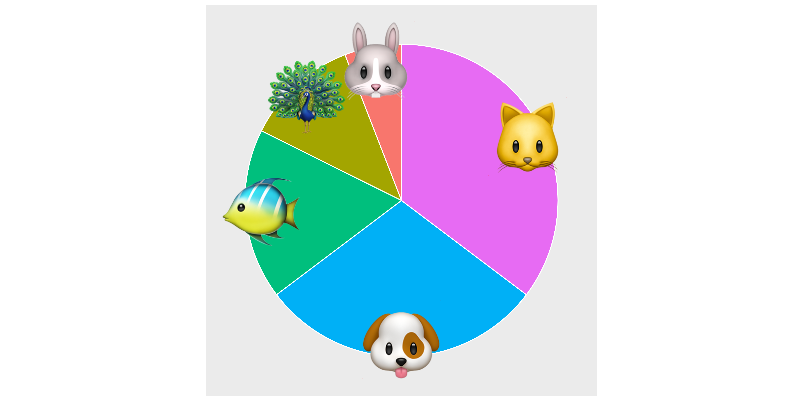

# Fries per second (Norm and ’Squatch Make a New Friend - Joshua Starmer)

``` r
real_fries_table <- data.frame(id_fry = 1:7, 
                               seconds = c(1, 1, 2, 1, 2, 3, 1) |> as.character(),
                               height =  c(1, 2, 1, 3, 2, 1, 4),
                               item = rep("🟨",7))


all_fries_table <- data.frame(id_fry = 1:10, 
                              seconds = c(1, 1, 2, 1, 2, 3, 1, 1,2,3)  |> as.character(),
                              height =  c(1, 2, 1, 3, 2, 1, 4, 5, 3, 2),
                              item = c(rep("🟨", 7), 
                                        rep("🟩", 3),
                              ind_real = c())
                              )

imaginary_fries_table <- all_fries_table |> slice(8:10)
```

``` r
chart_tile <- function(...){
  
  list(
    qlayer(geom = qproto_update(GeomTile, aes( width = .75, height = .75)), ...),
    coord_equal()
    
  )
  
}


set_color <- function(color){
  
  aes(fill = I(color |> alpha(.5)) , color = I(color))
  
}
```

``` r
real_fries_table |>
  ggkids() + 
  use(x = seconds, 
      y = height, 
      picture = item) + 
  chart_point() 
```

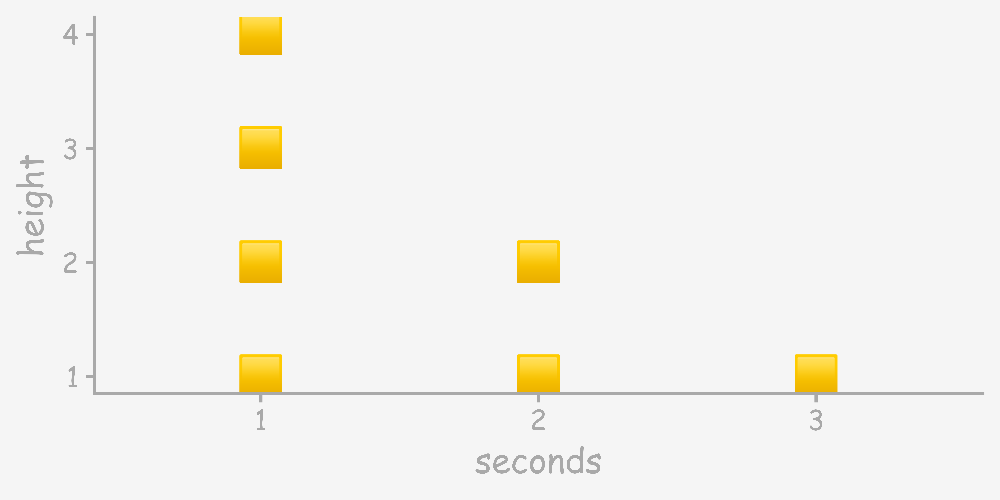

``` r

last_plot() %+% all_fries_table
```

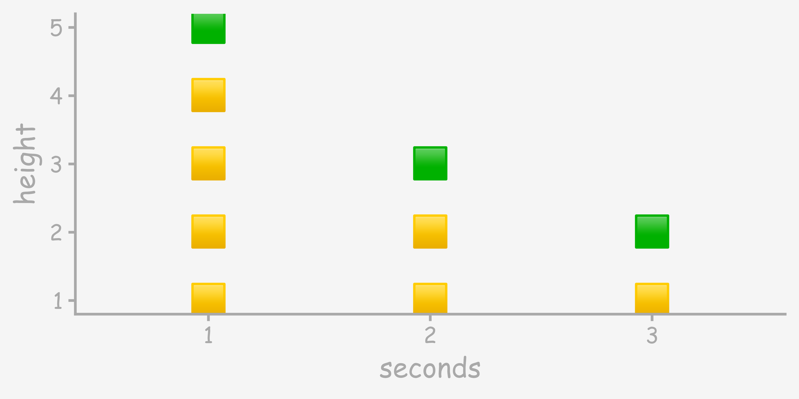

``` r

real_fries_table |>
  ggkids() + 
  use(x = seconds, y = height) + 
  chart_tile() + 
  set_color("goldenrod2")
```

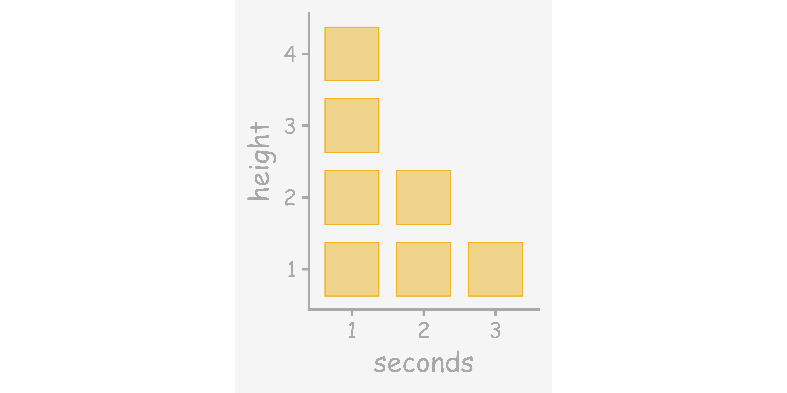

``` r

last_plot() +
  chart_tile(
    data = imaginary_fries_table,
    set_color("darkseagreen4")
    )
```

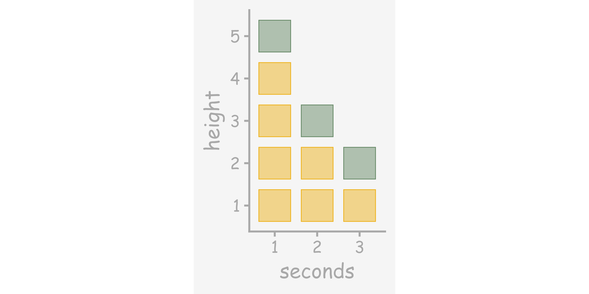

# A jungle bar chart… ?

<details>

``` r
theme_chart_bar <- function(){
  theme(panel.grid.minor = element_blank(), 
        panel.grid.major.x = element_blank(),
        axis.ticks.x = element_blank())
  }

chart_bar <- function(...){
  list(geom_col(...), 
       theme_chart_bar(),
       scale_y_continuous(expand = expansion(c(0, .3))),
       labs(x = NULL))
}

compute_item_stack <- function(data, scales, width = 0.2){
               
    data$shape <- data$shape %||% data$picture

    data |> 
      uncount(y) |>
      dplyr::mutate(row = row_number()) |> 
      dplyr::mutate(y = row - 
        0.5) |>
      dplyr::mutate(width = width)
    
  }

chart_item_stack <- function(...){
  
  list(
  qlayer(
    geom = GeomPointFill, 
    stat = qstat(compute_item_stack)
  ),
  # spacing
  qlayer(
    geom = GeomTile, 
    stat = qstat(compute_item_stack), 
    alpha = 0
  ),
  scale_y_continuous(expand = expansion(c(0, .3))),
  aes_default(aes(y = 1)),
  aes_default(aes(x = "All")),
  labs(x = NULL, y = NULL),
  guides(y = "none")
  )

  
}

ggprop.test:::compute_group_bricks
#> function (data, scales, width = 0.2) 
#> {
#>     data %>% dplyr::mutate(row = row_number()) %>% dplyr::mutate(y = row - 
#>         0.5) %>% dplyr::mutate(width = width)
#> }
#> <bytecode: 0x13b575428>
#> <environment: namespace:ggprop.test>

jungle_table <- data.frame(tree = paste0("🌴#", 1:5), 
                     num_bunches = c(2, 5, 1, 2, 1), 
                     banana = "🍌")

jungle_table |> 
  select(x = tree, y = num_bunches, picture = banana) |>
  compute_item_stack()
#>       x picture shape row    y width
#> 1  🌴#1      🍌    🍌   1  0.5   0.2
#> 2  🌴#1      🍌    🍌   2  1.5   0.2
#> 3  🌴#2      🍌    🍌   3  2.5   0.2
#> 4  🌴#2      🍌    🍌   4  3.5   0.2
#> 5  🌴#2      🍌    🍌   5  4.5   0.2
#> 6  🌴#2      🍌    🍌   6  5.5   0.2
#> 7  🌴#2      🍌    🍌   7  6.5   0.2
#> 8  🌴#3      🍌    🍌   8  7.5   0.2
#> 9  🌴#4      🍌    🍌   9  8.5   0.2
#> 10 🌴#4      🍌    🍌  10  9.5   0.2
#> 11 🌴#5      🍌    🍌  11 10.5   0.2


real_fries_table <- data.frame(id_fry = 1:7, 
                               seconds = c(1, 2, 1, 1, 2, 3, 1),
                               height =  c(1, 1, 2, 3, 2, 1, 4))


all_fries_table <- data.frame(id_fry = 1:10, 
                               seconds = c(1, 2, 1, 1, 2, 3, 1, 1,2,3),
                               height =  c(1, 1, 2, 3, 2, 1, 4, 5, 4, 2))
# last_plot() + 
#   annotate(geom = GeomText,
#            x = I(.75), y = I(.72),
#            label = "🎈🎀🙏",
#            angle = -10,
#            size = 22,
#             )  
```

</details>

``` r
jungle_table
#>   tree num_bunches banana
#> 1 🌴#1           2     🍌
#> 2 🌴#2           5     🍌
#> 3 🌴#3           1     🍌
#> 4 🌴#4           2     🍌
#> 5 🌴#5           1     🍌

ggplot(jungle_table) + 
  use(x = tree,
      y = num_bunches, 
      picture = banana) + # you could also use "🍌"
  chart_item_stack()
```

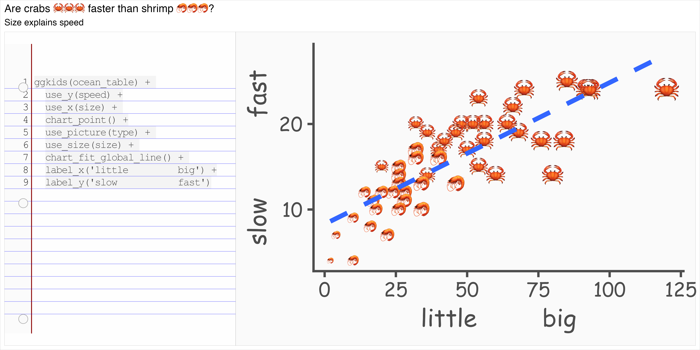

``` r


last_plot() + 
  stamp_picture("🐒",
                size = 40,
                x = I(.95),
                y = I(.15)) + 
  coord_cartesian(clip = "off")
```

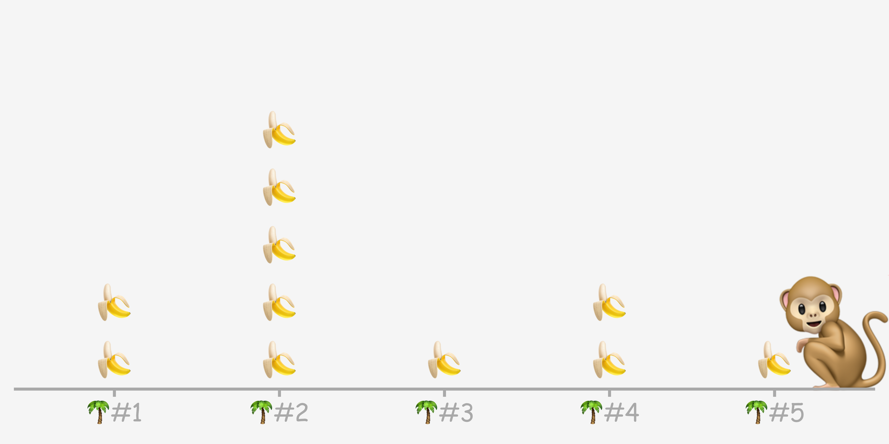

``` r


head(jungle_table)
#>   tree num_bunches banana
#> 1 🌴#1           2     🍌
#> 2 🌴#2           5     🍌
#> 3 🌴#3           1     🍌
#> 4 🌴#4           2     🍌
#> 5 🌴#5           1     🍌

ggplot(jungle_table) + 
  encode(x = tree,
         y = num_bunches) + 
  chart_bar(fill = "gold")
```

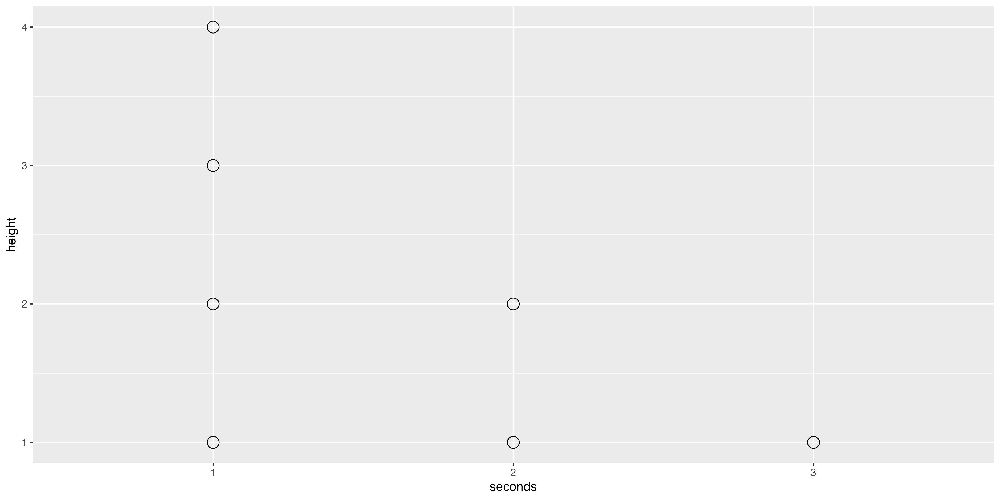

# Polar Bears

``` r
chart_bar_plunging <- function(...){
  list(geom_col(...), 
       theme_chart_bar(),
       scale_y_reverse(expand = expansion(c(.3, 0))),
       scale_x_discrete(position = "top"),
       labs(x = NULL),
       geom_label(vjust = 1, aes(label = after_stat(y)),
                  linewidth = 0)
       )
}
```

``` r
bears <- paste0("🐻‍❄️ #", 1:5)
depth <- c(3,5,4,6,5)

polar_bear_table <- data_frame(bears, depth)

usethis::use_data(polar_bear_table, overwrite = T)
```

``` r

tribble(~id_bear, ~depth,
            "🐻‍❄️#1",    3,
            "🐻‍❄️#2",    5,
            "🐻‍❄️#3",    4,
            "🐻‍❄️#4",    6,
            "🐻‍❄️#5",    5) |>
ggplot() +
  use(x = bears, y = depth) +
  chart_bar_plunging(
    fill = "lightblue1"
    ) 
```

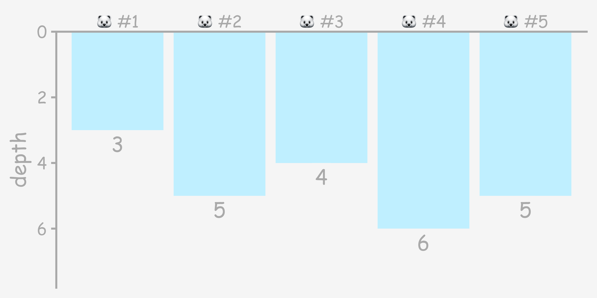

# digging

``` r
time <- c(0, 15, 30, 45, 60)
num_tunnels <- c(0, 4, 5, 5.5, 5.9)
fork_and_spoon_table <- data_frame(time, num_tunnels, type = "🍴")

shovel_and_bucket_table <- data_frame(time, num_tunnels = num_tunnels * 2, type = "🪣")

paws_table <- data_frame(time, num_tunnels = num_tunnels * 3, type = "🐾")

chart_line <- geom_line

digging_table <- fork_and_spoon_table |>
  bind_rows(shovel_and_bucket_table) |>
  bind_rows(paws_table)

ggplot(digging_table) +
  use_x(time) + 
  use_y(num_tunnels) + 
  use(picture = type) +
  chart_line() +
  chart_point() + 
  labs(x = "⏱️")
```

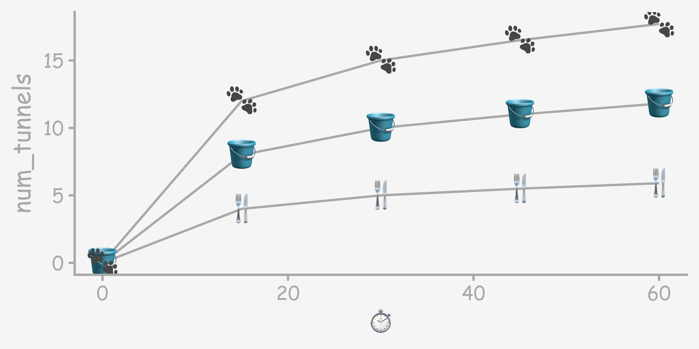

# Shuttles (future work)

<details>

``` r

outer_space_data <- data.frame(shuttle = paste0("🚀 #", 1:6), fuel = c(.3,.5,.3, .8,.7, .4))

chart_part_of_full <- function(...){
  
  list(
       geom_col(fill = "transparent", aes(y = 1)),
       geom_col( ... ),
       aes_default(aes(color = from_theme(ink)))
       )
  
}

stamp_hline <- function(y = .5, linetype = "dashed", ...){
  
  geom_hline(yintercept = y, linetype = linetype, ...)
  
}
```

</details>

``` r
outer_space_data
#>   shuttle fuel
#> 1   🚀 #1  0.3
#> 2   🚀 #2  0.5
#> 3   🚀 #3  0.3
#> 4   🚀 #4  0.8
#> 5   🚀 #5  0.7
#> 6   🚀 #6  0.4

ggplot(outer_space_data) +
  use(x = shuttle,
      y = fuel) +
  chart_part_of_full(fill = "darkolivegreen3") +
  stamp_hline(.75)
```

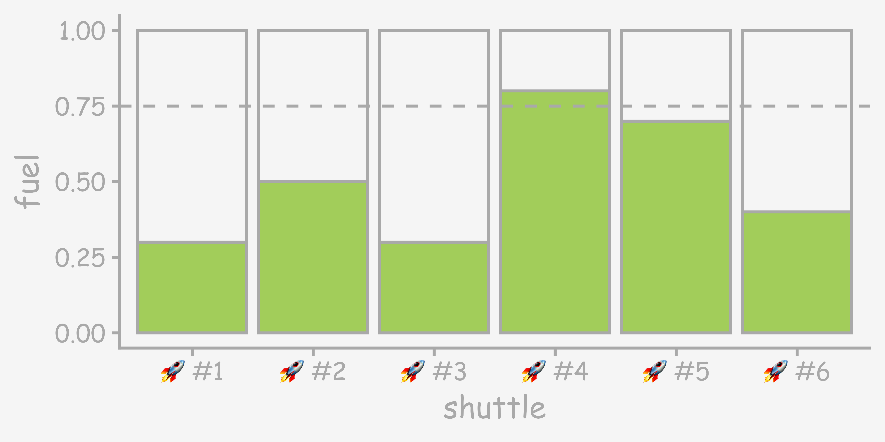

``` r


last_plot() + 
  stamp_picture("👽",
                angle = 25,
                size = 40,
                x = I(.95),
                y = I(.15)) + 
  coord_cartesian(clip = "off")
```

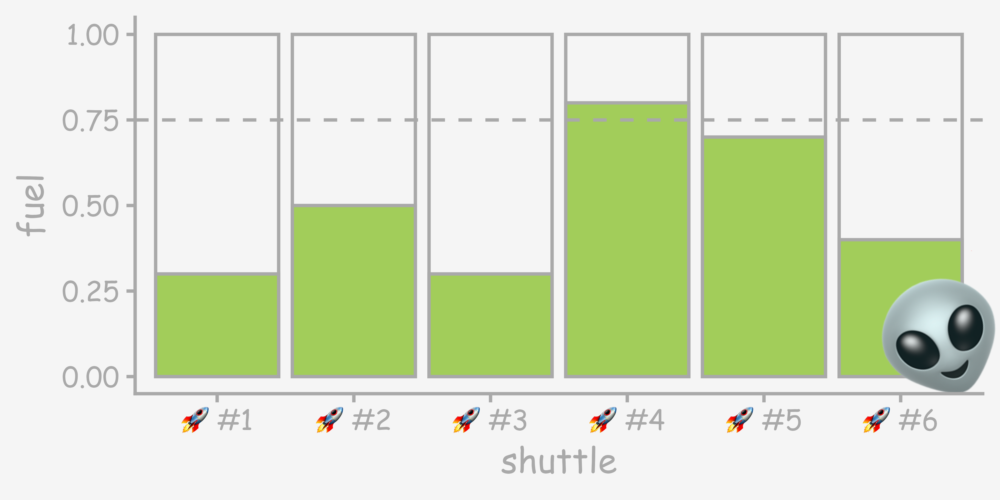

# scooter repair

``` r
weeks <- c(0,1,2)
num_coins <- c(1,2,3)
coin <- c("🪙", "🪙🪙", "🪙🪙🪙")

scooter_table <- tibble(weeks, num_coins, coin)

usethis::use_data(scooter_table, overwrite = T)
```

``` r
compute_panel_count <- function(data, scales){
            data |> 
             uncount(y, .remove = F)
           }

scooter_table |> 
  select(x = weeks, y = num_coins) |> 
  compute_panel_count()
#> # A tibble: 6 × 2
#>       x     y
#>   <dbl> <dbl>
#> 1     0     1
#> 2     1     2
#> 3     1     2
#> 4     2     3
#> 5     2     3
#> 6     2     3

chart_point_count <- function(...){
  list(
  qlayer(geom = GeomPointFill,
         stat = qstat(compute_panel = compute_panel_count), 
         position = position_jitter(width = .12, height = .12),
         ..., show.legend = F),
  aes_default(aes(x = 0)),
  aes_default(aes(y = 0)),
  aes_default(aes(shape = I(after_stat(picture)))),
  scale_size(range = c(2,10))
  
  )
  }
```

``` r
scooter_table
#> # A tibble: 3 × 3
#>   weeks num_coins coin  
#>   <dbl>     <dbl> <chr> 
#> 1     0         1 🪙    
#> 2     1         2 🪙🪙  
#> 3     2         3 🪙🪙🪙

set.seed(12345)
ggplot(scooter_table) +
  use_x(weeks) + 
  use_y(num_coins) + 
  use_picture("🪙") +
  chart_line() +
  chart_point_count() + 
  stamp_hline(2.25)
```

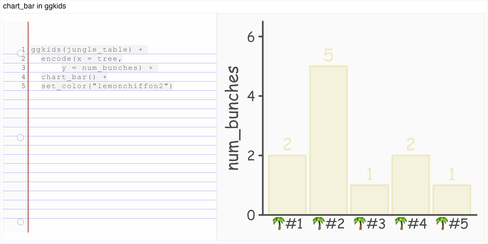

``` r
  

last_plot() + 
  stamp_picture("🛴",
                y = 2.45,
                x = 1.9,
                size = 45,
                angle = 10)
```

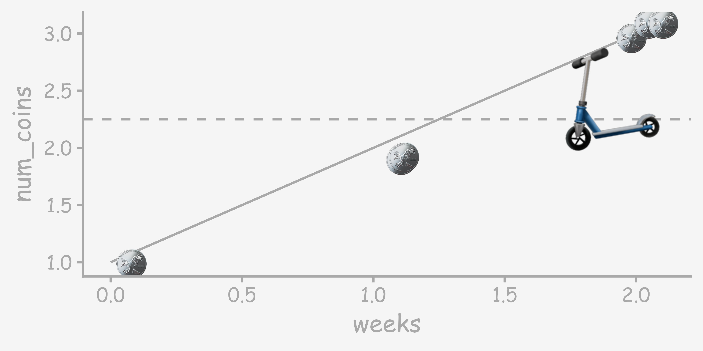
